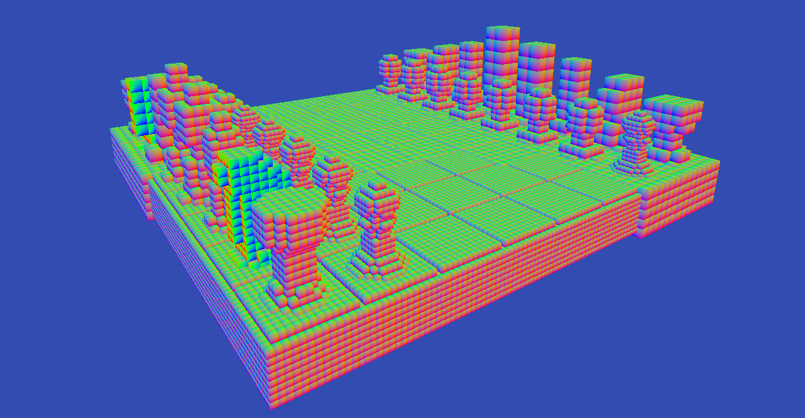
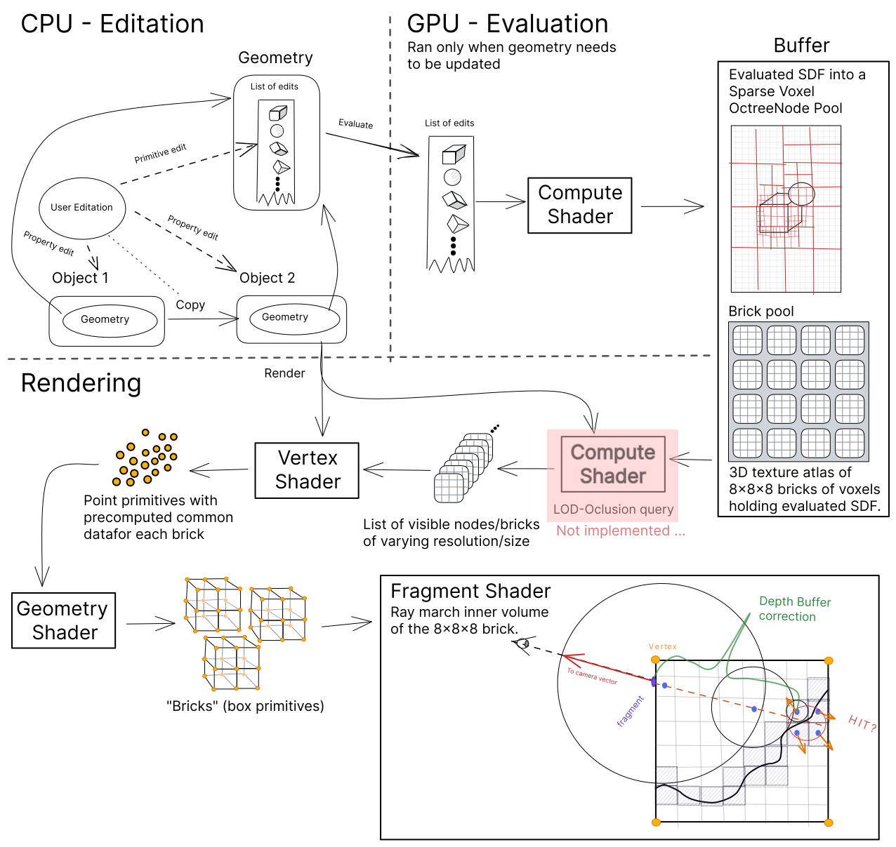

# SDFEdit

This repo contains a finished project of a SDF Scene renderer to submitted as a semestral project for combined for two classes: "GMU - Graphic and Multimedia Processors" and "PGPa - Advanced Computer Graphics" on [Brno University
Of Technology](https://www.vut.cz/en) - [*Faculty Of InformationTechnology*](https://www.fit.vut.cz/.en).

This is a technology prototype for my upcoming master's thesis implementing a SDF-based 3D sculpting application in Rust: *Link here to "sdf-editor-rust" here*

[PRGChess](https://github.com/xfusek08/PRGChess) is a predecessor to this project and it can be tough as a learning experience of basic OpenGL and C++ for this project.

## Installation and Running

### Prerequisites

- CMake 3.18 or newer
- C++ compiler with C++20 support
- OpenGL 4.6 core or newer

### Cloning repo
*Repository contains all dependencies as submodules.*

```bash
git clone https://github.com/xfusek08/PRGChess.git --recursive
```

### Debug build

```bash
mkdir build && cd build
cmake -DCMAKE_BUILD_TYPE=Debug ..
make -j
```

### Release build

```bash
mkdir build && cd build
cmake -DCMAKE_BUILD_TYPE=Release ..
make -j
```

### Run the app

```bash
./SDFEdit
```
## Controls

- <kbd>↑</kbd><kbd>←</kbd> <kbd>↓</kbd> <kbd>→</kbd> - rotate orbit camera.
- <kbd>W</kbd> <kbd>A</kbd> <kbd>S</kbd> <kbd>D</kbd> - move on `xz` plane.
- <kbd>Q</kbd> <kbd>E</kbd> - move on `y` axis (up/down).
- `mouse-scroll` - zoom in/out.


## About

This is an extract from documentation.
Full documentation can be seen [here](doc/project.pdf).

### Introduction

This semester project is developed as a shared project for two classes: "GMU - Graphic and Multimedia Processors" and "PGPa - Advanced Computer Graphics".
As a disclaimer, it should be noted that this project is still a work in progress and its final goal is beyond the scope of one semester's work. It will be improved and built upon in my upcoming master's thesis.
Therefore, the results achieved thus far are more of a proof of concept rather than a finished, self-contained work.

### Motivation

The final goal of the upcoming thesis is to develop a simple, user-friendly 3D sculpting application using a non-traditional technique for storing and rendering 3D models developed by "[Media Molecule](https://www.mediamolecule.com/)" for its game "[Dreams](https://www.mediamolecule.com/games/dreams)".
This game engine is accessible to unexperienced, non-technical users and allows for the creation of highly detailed 3D models and scenes without worrying about polygon counts, texturing, or levels of detail.

This project is based on my research of the basic principles of this technology and the possible implementation of a simplified version for PC users.

### Goals

To stay within the scope of the two classes, the aim of this work will be a GPU-based evaluator (for GMU) and a 3D renderer of the resulting representation (for PGPa).
The basic idea is to have the geometry of a 3D model represented by "Constructive Solid Geometry" (CSG) of a small set of basic primitive shapes, which will be evaluated into a "Signed Distance Field". This field will be rendered onto the screen using an optimized "rasterization pipeline" on the GPU.

### Screenshots

#### All possible shapes

#### Chess scene inspired by [PRGChess](https://github.com/xfusek08/PRGChess)


*Following image shows a rasterized SDF boxed without ray-marching.*



#### A dynamic SVO evaluation demo


#### A LOD/SVO level Selection demo


### Architecture overview



## Authors
[Petr Fusek](https://github.com/xfusek08)

## Project Evaluation

- GMU - Graphic and Multimedia Processors: 28/28 🥳
- PGPa - Advanced Computer Graphics: 30/30 🥳

## Vendor libraries used

- [glm](https://github.com/g-truc/glm)
- [json](https://github.com/nlohmann/json)
- [glad](https://glad.dav1d.de)
- [glfw](https://www.glfw.org/)
- [imgui](https://github.com/ocornut/imgui)
- [dormon/imguiVars](https://github.com/dormon/imguiVars)
- [dormon/Vars](https://github.com/dormon?tab=repositories)
